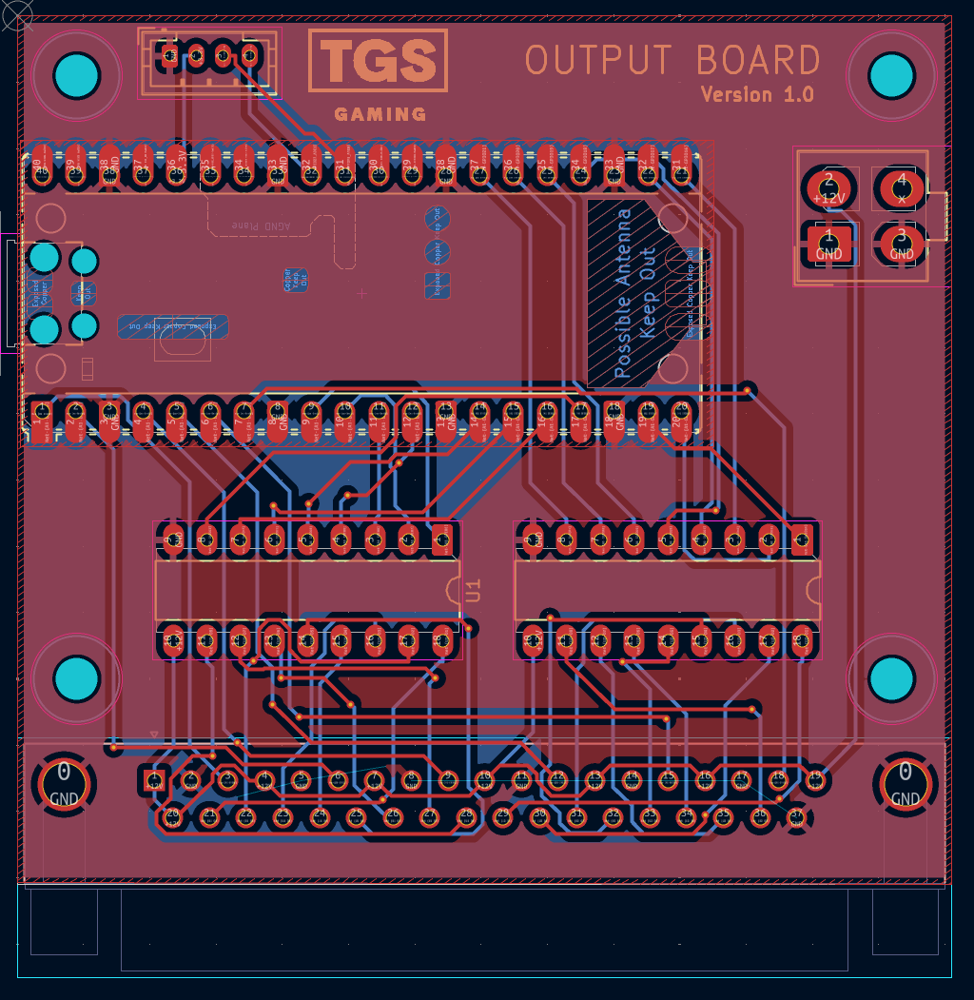

# TGS Hardware

TGS Hardware Projects

[Documentation](https://github.com/tgs-gaming/hardware/wiki)

## TGS INPUT board
[INPUT BOARD USAGE MANUAL](https://github.com/tgs-gaming/hardware/wiki/TGS-INPUT-BOARD-USAGE-MANUAL)

## 

## TGS INPUT/OUTPUT board

## TGS OUTPUT board

