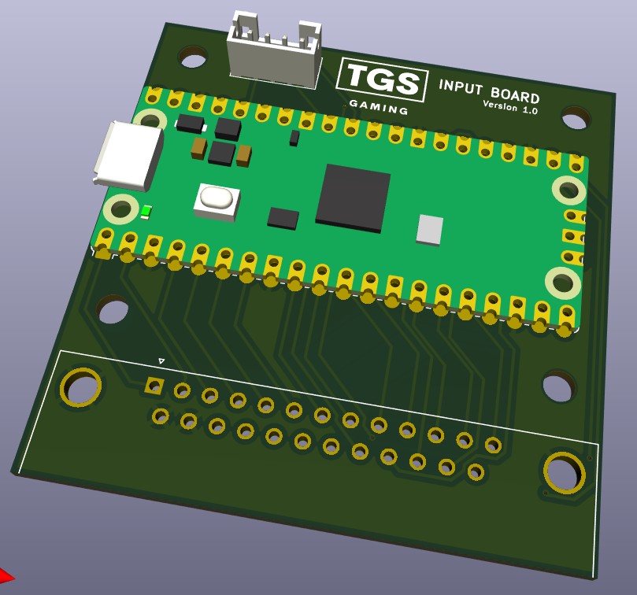
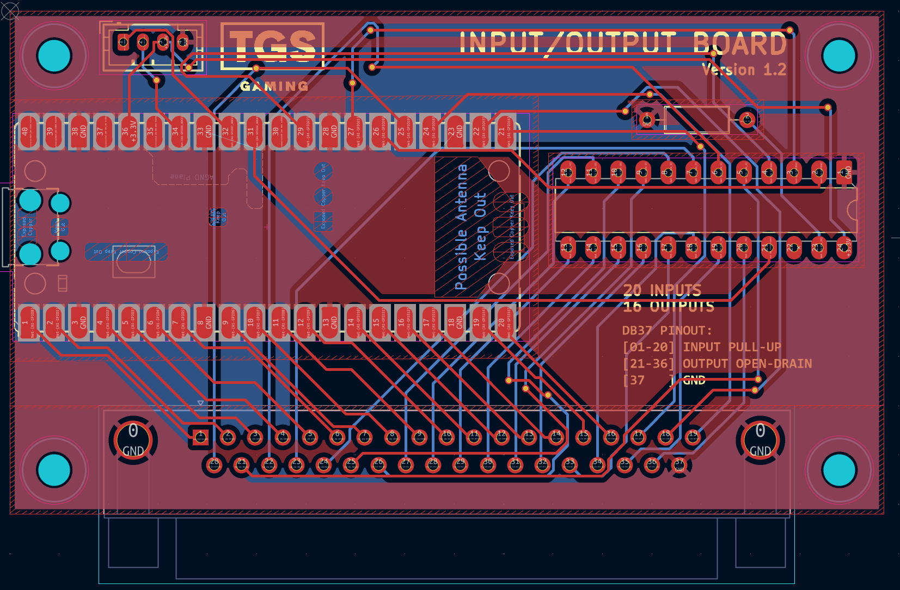
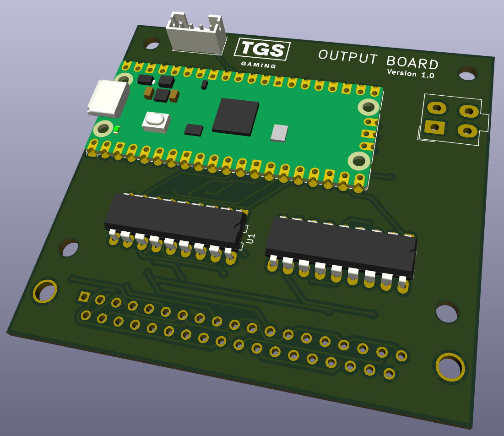

# TGS Hardware

TGS Hardware Projects

[Documentation](docs/README.md)

## TGS INPUT board

[INPUT BOARD USAGE MANUAL](docs/tgs_input_board_usage_manual.md)

Board Configuration Tool

## 

## TGS INPUT/OUTPUT board

## TGS OUTPUT board

